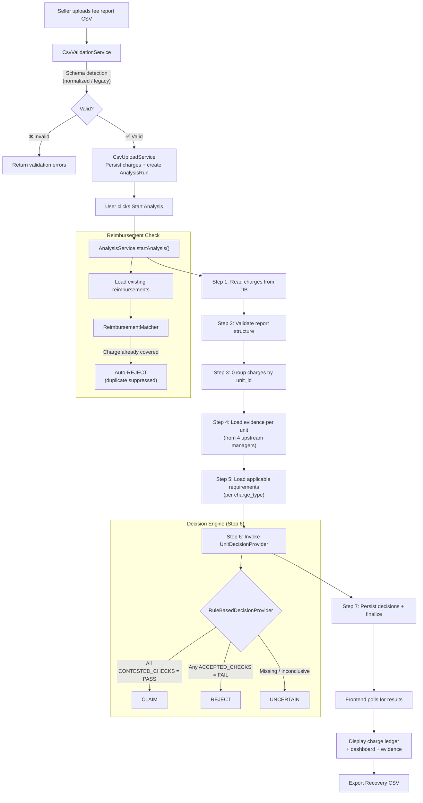
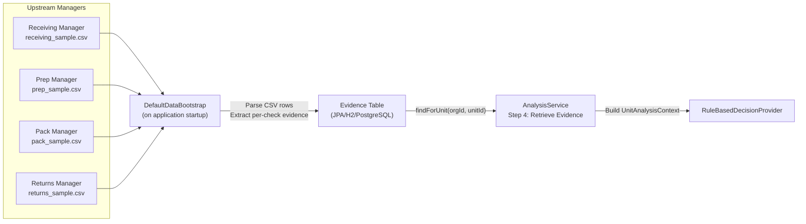
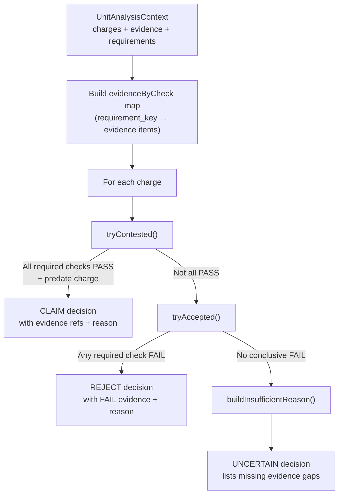
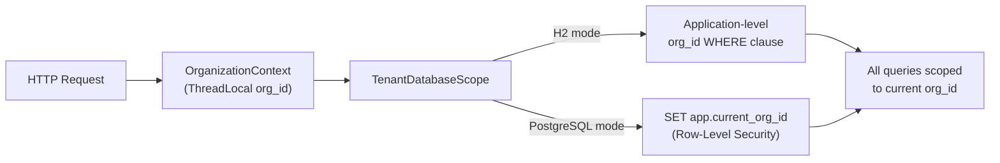

# Architecture — Sydon Recovery Manager

**CUBE Buildathon · Commerce Context Stream**

This document describes the system architecture, component design, data flow, model/agent usage, and key engineering decisions behind Sydon Recovery Manager.

---

## Table of Contents

- [System Architecture](#system-architecture)
- [Components](#components)
- [Data Flow](#data-flow)
- [Model / Agent Usage](#model--agent-usage)
- [Important Engineering Decisions](#important-engineering-decisions)

---

## System Architecture

Sydon Recovery Manager is a three-tier application comprising a React frontend, a Spring Boot backend with a rule-based decision engine, and an optional Python AI model service.

### High-Level Architecture

```
┌────────────────────────────────────────────────────────────────────────────┐
│                                 CLIENT                                     │
│                          Browser (Chrome/Edge)                             │
└───────────────────────────────┬────────────────────────────────────────────┘
                                │ HTTPS
┌───────────────────────────────▼────────────────────────────────────────────┐
│                        PRESENTATION LAYER                                  │
│                  React 19 + Vite 8 + TypeScript 7                          │
│                                                                            │
│  ┌────────────┐ ┌────────────┐ ┌────────────┐ ┌────────┐ ┌────────────┐   │
│  │UploadPanel │ │ ResultsView│ │ Dashboard  │ │Evidence│ │ Analytics  │   │
│  │            │ │            │ │   View     │ │Explorer│ │   Panel    │   │
│  └────────────┘ └────────────┘ └────────────┘ └────────┘ └────────────┘   │
│  ┌────────────┐ ┌────────────┐ ┌────────────┐ ┌────────────────────────┐  │
│  │ ChargeTable│ │ReviewQueue │ │ Processing │ │ ChargeInvestigation    │  │
│  │            │ │            │ │  Pipeline  │ │                        │  │
│  └────────────┘ └────────────┘ └────────────┘ └────────────────────────┘  │
└───────────────────────────────┬────────────────────────────────────────────┘
                                │ REST API  /api/*
                                │ (Vite proxy in dev, static bundle in prod)
┌───────────────────────────────▼────────────────────────────────────────────┐
│                         APPLICATION LAYER                                  │
│               Spring Boot 3.x · Java 25 · Maven                           │
│                                                                            │
│  ┌─────────────────────────── CONTROLLERS ────────────────────────────┐    │
│  │ AnalysisController │ ChargeController │ EvidenceController         │    │
│  │ EvidenceImportController │ ReimbursementController                 │    │
│  └────────────────────────────────────────────────────────────────────┘    │
│                                                                            │
│  ┌─────────────────────────── SERVICES ───────────────────────────────┐    │
│  │ AnalysisService         ── orchestrates the 7-step pipeline        │    │
│  │ CsvUploadService        ── parses & validates uploaded CSVs        │    │
│  │ CsvValidationService    ── schema detection & column validation    │    │
│  │ EvidenceImportService   ── ingests evidence from 4 managers        │    │
│  │ ReimbursementImportService ── imports existing reimbursements      │    │
│  │ ReimbursementMatcher    ── suppresses duplicate claims             │    │
│  │ DefaultDataBootstrap    ── seeds evidence fixtures on startup      │    │
│  │ ChargeResponseMapper    ── entity → DTO mapping                    │    │
│  └────────────────────────────────────────────────────────────────────┘    │
│                                                                            │
│  ┌─────────────────────────── DECISION ENGINE ────────────────────────┐    │
│  │ «interface» UnitDecisionProvider                                   │    │
│  │     │                                                              │    │
│  │     ├── RuleBasedDecisionProvider  (@Primary, deterministic)       │    │
│  │     ├── PythonUnitDecisionProvider (HTTP bridge to AI model)       │    │
│  │     └── UnconfiguredAiDecisionProvider (fallback: all UNCERTAIN)   │    │
│  └────────────────────────────────────────────────────────────────────┘    │
│                                                                            │
│  ┌─────────────────────────── PERSISTENCE ────────────────────────────┐    │
│  │ JPA/Hibernate Entities: AnalysisRun, Charge, Decision, Evidence,   │    │
│  │                         Requirement, Reimbursement, ValidationIssue │    │
│  │ Database: H2 (embedded dev) │ PostgreSQL (production)              │    │
│  │ Tenant isolation via TenantDatabaseScope + OrganizationContext      │    │
│  └────────────────────────────────────────────────────────────────────┘    │
└───────────────────────────────┬────────────────────────────────────────────┘
                                │ HTTP (optional)
┌───────────────────────────────▼────────────────────────────────────────────┐
│                       AI MODEL LAYER (Optional)                            │
│                Python 3.11+ · FastAPI · Uvicorn                            │
│                                                                            │
│  ┌────────────────┐  ┌──────────────────┐  ┌──────────────────────────┐   │
│  │ model_runtime  │  │ evidence_adapter │  │ schemas.py               │   │
│  │ LocalModelRun- │  │ maps raw evidence│  │ request/response DTOs    │   │
│  │ time (Qwen2.5) │  │ to charge context│  │ + fallback logic         │   │
│  └────────────────┘  └──────────────────┘  └──────────────────────────┘   │
│  ┌──────────────────────────────────────────────────────────────────────┐  │
│  │ amazon_rules.json — charge-type → evidence requirement mapping      │  │
│  └──────────────────────────────────────────────────────────────────────┘  │
└────────────────────────────────────────────────────────────────────────────┘
```

### Deployment Topology

```
┌─── Docker Container (Production) ──────────────────────────────┐
│                                                                 │
│  ┌── Stage 1: Frontend Build (node:22-alpine) ──────────────┐  │
│  │  npm install → vite build → /dist                        │  │
│  └──────────────────────────────────────────────────────────┘  │
│                          ↓ COPY dist → static/                  │
│  ┌── Stage 2: Backend Build (eclipse-temurin:25-jdk) ───────┐  │
│  │  mvn clean package -DskipTests → app.jar                 │  │
│  └──────────────────────────────────────────────────────────┘  │
│                          ↓                                      │
│  ┌── Stage 3: Runtime (eclipse-temurin:25-jre) ─────────────┐  │
│  │  java -XX:+UseContainerSupport -Xmx350m -jar app.jar    │  │
│  │  Serves both API + static frontend on port 8080          │  │
│  └──────────────────────────────────────────────────────────┘  │
│                                                                 │
│  Memory: 350MB heap · Render free tier compatible               │
└─────────────────────────────────────────────────────────────────┘
```

---

## Components

### Frontend Components

| Component | File | Responsibility |
|---|---|---|
| **UploadPanel** | `UploadPanel.tsx` | Drag-and-drop CSV upload, schema validation display, reimbursement import, "Start Analysis" trigger |
| **ProcessingPipeline** | `ProcessingPipeline.tsx` | Real-time 7-step progress tracker with step-by-step status updates |
| **ResultsView** | `ResultsView.tsx` | Summary metrics bar (gross ledger, recoverable, legitimate, manual review), CSV export, tab routing |
| **ChargeTable** | `ChargeTable.tsx` | Paginated charge ledger with decision badges (CLAIM/REJECT/UNCERTAIN), filtering by decision type and fee category |
| **DashboardView** | `DashboardView.tsx` | Recovery snapshot, decision overview visualization (horizontal bar chart), review queue summary, decision timeline |
| **EvidenceExplorer** | `EvidenceExplorer.tsx` | Unified Evidence Master Ledger — 4-manager filter (Receiving, Prep, Pack, Returns), PASS/FAIL/UNCERTAIN status, search |
| **ReviewQueue** | `ReviewQueue.tsx` | Uncertain charge cards with discrepancy notes, evidence gap details, inspection links |
| **ChargeInvestigation** | `ChargeInvestigation.tsx` | Deep-dive dossier for individual charges — full evidence trail, requirement checks, telemetry timeline |
| **AnalyticsPanel** | `AnalyticsPanel.tsx` | Operational KPIs, claim/reject/uncertain counts, charge breakdown by type with claim rates and dollar amounts |
| **FileStatus** | `FileStatus.tsx` | Post-upload file metadata display — filename, size, row count, schema integrity badge |
| **DecisionBadge** | `DecisionBadge.tsx` | Reusable color-coded badge (green CLAIM, dark REJECT, amber UNCERTAIN) |
| **Header** | `Header.tsx` | Navigation bar with tab routing (Dashboard, Charges, Evidence, Reviews, Analytics) |
| **ErrorState** | `ErrorState.tsx` | Error and recovery state display with retry actions |

### Backend Services

| Service | File | Responsibility |
|---|---|---|
| **AnalysisService** | `AnalysisService.java` | Core orchestrator — runs the 7-step pipeline, iterates over units, invokes the decision provider, persists results |
| **CsvUploadService** | `CsvUploadService.java` | Parses uploaded CSV, creates `AnalysisRun`, persists charge rows with org_id scoping |
| **CsvValidationService** | `CsvValidationService.java` | Auto-detects schema (normalized, legacy, reimbursement), validates required columns, reports missing/extra fields |
| **EvidenceImportService** | `EvidenceImportService.java` | Imports upstream evidence CSVs from 4 manager types, deduplicates by `recordId`, extracts per-check evidence rows |
| **ReimbursementImportService** | `ReimbursementImportService.java` | Parses reimbursement CSVs, persists to DB for duplicate claim suppression |
| **ReimbursementMatcher** | `ReimbursementMatcher.java` | Cross-references charges against imported reimbursements to identify already-covered claims |
| **DefaultDataBootstrap** | `DefaultDataBootstrap.java` | `ApplicationRunner` that seeds evidence fixtures and requirement specifications on startup for demo orgs |
| **ChargeResponseMapper** | `ChargeResponseMapper.java` | Maps JPA entities to API response DTOs, attaches decision and evidence metadata |

### Decision Providers

| Provider | File | Role |
|---|---|---|
| **RuleBasedDecisionProvider** | `RuleBasedDecisionProvider.java` | **Primary** (`@Primary`). Deterministic rule engine with `CONTESTED_CHECKS` and `ACCEPTED_CHECKS` maps per charge type. No ML dependency. |
| **PythonUnitDecisionProvider** | `PythonUnitDecisionProvider.java` | HTTP bridge to the Python AI model. Serializes `UnitAnalysisContext` to JSON, calls `POST /v1/analyze-unit`, deserializes response. |
| **UnconfiguredAiDecisionProvider** | `UnconfiguredAiDecisionProvider.java` | Fallback when neither the rule engine nor Python model is available. Returns UNCERTAIN for all charges. |

### JPA Entities

| Entity | Purpose |
|---|---|
| **AnalysisRun** | Represents a single analysis session — tracks status (CREATED → VALIDATED → PROCESSING → COMPLETED), row counts, filename, timestamps |
| **Charge** | Individual fee line-item from the uploaded CSV — charge_id, unit_id, charge_type, amount, posted_date, org_id |
| **Decision** | The system's verdict for a charge — decision_type (CLAIM/REJECT/UNCERTAIN), reason text, evidence references, rule references |
| **Evidence** | A single evidence check from an upstream manager — unit_id, source_type, requirement key, status (PASS/FAIL/UNCERTAIN), finding, timestamp |
| **Requirement** | Amazon policy requirement definition — charge_type, rule description, verification criteria |
| **Reimbursement** | Previously-paid reimbursement record — used for duplicate claim suppression |
| **ValidationIssue** | Row-level validation error (e.g., org_id mismatch) — surfaced transparently but excluded from analysis |

### AI Model Components (Python)

| Component | File | Purpose |
|---|---|---|
| **LocalModelRuntime** | `model_runtime.py` | Loads Qwen2.5-1.5B-Instruct via HuggingFace Transformers, generates JSON decisions with threading locks for concurrent safety |
| **EvidenceAdapter** | `evidence_adapter.py` | Transforms raw evidence records into structured charge-context prompts, maps charge types to applicable rules from `amazon_rules.json` |
| **Schemas** | `schemas.py` | Pydantic-style request/response DTOs, fallback decision logic, model output normalization (contested→CLAIM, accepted→REJECT, insufficient_evidence→UNCERTAIN) |
| **Amazon Rules** | `amazon_rules.json` | Declarative charge-type → evidence requirement mapping with contestation criteria |

---

## Data Flow

### End-to-End Pipeline



### Evidence Ingestion Flow



### Per-Unit Decision Flow



### Tenant Isolation Flow



---

## Model / Agent Usage

### Primary: Rule-Based Decision Engine (No ML)

The production decision engine is **fully deterministic** — no machine learning model is involved in the default deployment. `RuleBasedDecisionProvider` uses two static configuration maps:

```java
// Evidence checks required for a CLAIM (all must be PASS)
CONTESTED_CHECKS = {
    "inbound_defect_fee":              ["fnsku_label_flat", "manufacturer_barcode_covered"],
    "lost_inbound":                    ["quantity_matches_po"],
    "damaged_in_warehouse":            ["unit_undamaged"],
    "refund_issued_item_not_returned": ["identity_matches_order", "completeness_verified"],
    "fulfilment_fee_weight_tier":      ["fnsku_label_flat"]
}

// Evidence checks that confirm a REJECT (any must be FAIL)
ACCEPTED_CHECKS = {
    "inbound_defect_fee":              ["fnsku_label_flat", "manufacturer_barcode_covered", "polybag_present"],
    "lost_inbound":                    ["quantity_matches_po"],
    "damaged_in_warehouse":            ["unit_undamaged", "carton_undamaged"],
    "refund_issued_item_not_returned": ["completeness_verified", "condition_grade", "identity_matches_order"],
    "fulfilment_fee_weight_tier":      ["fnsku_label_flat", "unit_undamaged"]
}
```

**Decision algorithm:**
1. For each charge in the unit, look up the charge type.
2. **Try CLAIM:** Check if *all* keys in `CONTESTED_CHECKS[chargeType]` have at least one PASS evidence record that predates the charge date. If yes → **CLAIM**.
3. **Try REJECT:** Check if *any* key in `ACCEPTED_CHECKS[chargeType]` has a FAIL evidence record. If yes → **REJECT**.
4. **Fallback:** If neither condition is met, build an insufficient-evidence reason listing the missing checks → **UNCERTAIN**.

### Optional: LLM-Based Decision Provider (Python Sidecar)

The `AI model/` directory contains an **alternative** decision provider using a small language model:

| Attribute | Value |
|---|---|
| **Model** | Qwen/Qwen2.5-1.5B-Instruct |
| **Framework** | HuggingFace Transformers + Accelerate |
| **Serving** | FastAPI + Uvicorn on port 8090 |
| **Interface** | `POST /v1/analyze-unit` — receives `UnitAnalysisContext` JSON, returns `DecisionResponse` JSON |
| **Thread Safety** | `threading.Lock` around model loading and generation |
| **Output Format** | JSON: `{"decisions": [{"chargeId", "verdict", "reason", "evidenceRecordIds", "requirementIds"}]}` |

**How it integrates:**

```
Spring Boot                          Python FastAPI
    │                                      │
    │  PythonUnitDecisionProvider           │
    │  ─────────────────────────►          │
    │  POST /v1/analyze-unit               │
    │  {charges, evidence, requirements}   │
    │                                      │
    │  ◄─────────────────────────          │
    │  {decisions: [{verdict, reason}]}    │
    │                                      │
```

The `PythonUnitDecisionProvider` is **not `@Primary`** — it only activates when `RuleBasedDecisionProvider` is removed or when explicitly configured. The LLM approach was developed first but replaced by the deterministic engine for production reliability (see [Engineering Decisions](#important-engineering-decisions)).

### Why Not an Agent Architecture?

Recovery Manager does **not** use an autonomous agent loop (plan → act → observe → repeat). Instead it uses a **single-pass pipeline** where:
- The input is fully structured (CSV rows).
- The evidence is pre-loaded (not discovered at runtime).
- The decision logic is a direct evidence-to-rule match (not iterative reasoning).

An agent architecture would add latency, nondeterminism, and hallucination risk without improving decision quality for this domain.

---

## Important Engineering Decisions

### 1. Deterministic Rules Over LLM Inference

**Decision:** Replace the Qwen2.5-1.5B LLM with a hand-coded `RuleBasedDecisionProvider` as the `@Primary` decision engine.

**Why:**
- **Reproducibility:** Given the same charge + evidence, the system always produces the same decision. This is essential for audit compliance — Amazon requires traceable, explainable reasoning.
- **No hallucination risk:** Small language models (1.5B parameters) frequently hallucinate evidence references, invent requirement IDs, or produce invalid JSON. The rule engine has zero hallucination risk.
- **Performance:** Rule-based evaluation is ~1000x faster than LLM inference per charge. A 60-charge report completes in milliseconds vs. minutes with the LLM.
- **No GPU dependency:** The rule engine runs on any JVM with zero external dependencies. The LLM requires 4GB+ VRAM or falls back to slow CPU inference.

**Tradeoff:** The rule engine only covers 5 charge types. New charge types require manual rule authoring. The LLM could theoretically generalize to unseen charge types, but its accuracy was too low (~60% correct JSON output) to justify the risk.

### 2. Strategy Pattern for Decision Providers

**Decision:** Define `UnitDecisionProvider` as an interface with three implementations, using Spring's `@Primary` annotation to select the active one.

```java
public interface UnitDecisionProvider {
    boolean isConfigured();
    Map<String, DecisionSuggestion> analyzeUnit(UnitAnalysisContext context);
}
```

**Why:**
- **Swappable at deployment time:** Switch between rule-based, LLM-based, or unconfigured providers without code changes.
- **Graceful degradation:** If the Python model crashes, `AnalysisService` catches the exception and falls back to UNCERTAIN decisions rather than failing the entire analysis.
- **Testability:** Each provider can be unit-tested independently with mock `UnitAnalysisContext` objects.

### 3. Tenant Isolation via Org-Scoped Queries

**Decision:** Every database query filters by `org_id`, enforced by `TenantDatabaseScope`. On PostgreSQL, this uses Row-Level Security (`set_config('app.current_org_id', ...)`). On H2, it uses application-level WHERE clauses.

**Why:**
- **Data privacy:** Prevents cross-tenant data leakage when multiple organizations share the same database.
- **CSV row rejection:** Rows in uploaded CSVs whose `org_id` doesn't match the requesting organization are rejected and surfaced as `ValidationIssue` records — transparently excluded from analysis.
- **Dual-mode support:** H2 for development (no RLS), PostgreSQL for production (database-enforced RLS).

### 4. Evidence Fixture Bootstrap on Startup

**Decision:** `DefaultDataBootstrap` (an `ApplicationRunner`) loads upstream evidence CSVs from `data/upstream/` and requirement specs into the database on every application startup.

**Why:**
- **Zero-config demo:** The application is immediately usable after startup — no manual evidence import needed.
- **Idempotent:** Checks for existing records before inserting, so repeated startups don't create duplicates.
- **Simulates production:** In production, this would be replaced by API calls to the live Receiving, Prep, Pack, and Returns manager services. The bootstrap simulates that integration.

### 5. Duplicate Claim Suppression

**Decision:** Before generating decisions, `AnalysisService` calls `ReimbursementMatcher.findCoveredChargeIds()` to identify charges already covered by imported reimbursements. Covered charges are auto-REJECTed with the reason: *"A matching reimbursement covers this charge; duplicate claim suppressed."*

**Why:**
- **Seller risk mitigation:** Filing duplicate claims damages a seller's standing with Amazon and can trigger account-level penalties.
- **Explicit import workflow:** Reimbursements are imported as a separate CSV before analysis, giving the operator control over what's included.

### 6. Multi-Stage Docker Build

**Decision:** Use a three-stage Dockerfile — frontend build (Node 22), backend build (Java 25 + Maven), runtime (JRE 25).

**Why:**
- **Single container:** The compiled React frontend is bundled into Spring Boot's `src/main/resources/static/`, so the application serves both API and UI from one process on one port.
- **Minimal runtime image:** The final stage uses `eclipse-temurin:25-jre` (no JDK, no Node, no Maven), keeping the image lean.
- **Memory constrained:** `-Xmx350m -Xss512k` keeps the JVM within Render's free-tier memory limits.

### 7. UNCERTAIN as a First-Class Decision

**Decision:** UNCERTAIN is not an error state — it's a legitimate third decision category with its own UI treatment (amber badges, dedicated review queue, discrepancy notes explaining what evidence is missing).

**Why:**
- **Honest about gaps:** Rather than forcing a CLAIM or REJECT when evidence is missing or inconclusive, the system surfaces the gap explicitly.
- **Human-in-the-loop:** UNCERTAIN charges are routed to the Review Queue with specific notes like *"Missing upstream evidence for: fnsku_label_flat, manufacturer_barcode_covered"*, telling the reviewer exactly what to investigate.
- **No silent failures:** An UNCERTAIN decision is always accompanied by a reason explaining *why* the system couldn't decide.

### 8. No Auto-Filing of Claims

**Decision:** The system produces CLAIM/REJECT/UNCERTAIN recommendations but **never** automatically submits a dispute to Amazon.

**Why:**
- **Risk management:** Erroneous automated filings could trigger Amazon account suspensions.
- **Auditability:** Every recommendation must be reviewed by a human before action is taken, creating an audit trail.
- **Regulatory alignment:** Seller Central terms of service require evidence-backed human authorization for reimbursement claims.

### 9. Schema Auto-Detection

**Decision:** `CsvValidationService` auto-detects whether an uploaded CSV uses the normalized charge format, legacy ledger format, or reimbursement format — rather than requiring the user to specify.

**Why:**
- **User experience:** Sellers don't need to know which export format they downloaded from Seller Central.
- **Implementation:** The service checks for the presence of signature columns (`line_id` + `report_type` → legacy; `charge_id` + `granularity` → normalized; `reimbursement_id` + `approval_date` → reimbursement).

### 10. Frontend State Management Without External Libraries

**Decision:** The React frontend manages state with React's built-in `useState`/`useEffect` hooks and prop drilling rather than Redux, Zustand, or other state management libraries.

**Why:**
- **Simplicity:** The application has a single analysis session at a time — no complex cross-cutting state.
- **Bundle size:** Avoiding a state management library keeps the production bundle lean.
- **Buildathon scope:** For a time-boxed hackathon, minimizing dependency surface reduces integration risk.

---

## API Contract Summary

### Core Analysis Flow

```
POST   /api/charges/upload          → Upload CSV, create AnalysisRun
POST   /api/charges/analyze/{id}    → Start 7-step pipeline
GET    /api/charges/status/{id}     → Poll pipeline progress
GET    /api/charges/results/{id}    → Fetch full results + decisions
GET    /api/charges/{analysisId}    → Query individual charges (filterable)
```

### Evidence & Reimbursements

```
GET    /api/evidence                → Query evidence records (filterable by unit, manager, status)
POST   /api/evidence/import         → Import upstream evidence CSV
POST   /api/reimbursements/upload   → Import reimbursement history CSV
```

### Documentation

```
GET    /v3/api-docs                 → OpenAPI 3.0 specification
GET    /swagger-ui.html             → Interactive Swagger UI
```

---

*Architecture document · Sydon Recovery Manager · CUBE Buildathon*
